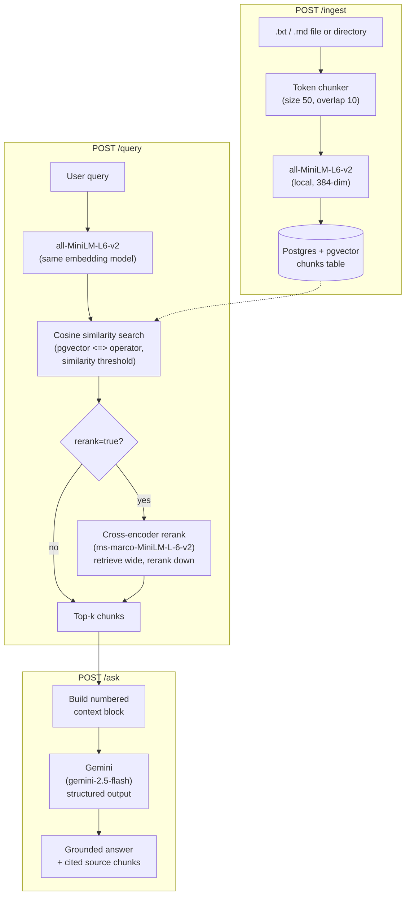

# RAG Anchor Project

A document QA / knowledge-retrieval API built from scratch (no LangChain/LlamaIndex)
so every stage of the pipeline — chunking, embedding, storage, retrieval, re-ranking,
generation — is explainable and independently testable. Retrieval quality is measured
with a real evaluation harness against SQuAD 2.0, not just eyeballed.

## Architecture



Each stage is also a standalone CLI (`python -m app.ingest`, `python -m app.retrieve`,
`python -m app.generate`) for quick manual testing outside the API.

## Stack

- **FastAPI** — API layer (`/ingest`, `/query`, `/ask`)
- **PostgreSQL + pgvector** — vector storage, cosine similarity search
- **Docker Compose** — reproducible local Postgres/pgvector
- **sentence-transformers** (`all-MiniLM-L6-v2`, local, 384-dim) — embeddings
- **sentence-transformers** (`cross-encoder/ms-marco-MiniLM-L-6-v2`, local) — optional re-ranking
- **Google Gemini** (`gemini-2.5-flash`) — grounded answer generation with structured, cited output

## Eval results

Retrieval quality benchmarked against a sample of the [SQuAD 2.0](https://rajpurkar.github.io/SQuAD-explorer/)
dev set (5 sampled contexts, 46 questions — 22 answerable, 24 unanswerable), comparing
baseline vector search against the same candidates re-ranked with a cross-encoder.

| k | Metric | Baseline | Re-ranked | Δ |
|---|---|---|---|---|
| 1 | Doc Recall@k | 93.5% | 97.8% | +4.3 pts |
| 1 | Doc MRR@k | 0.935 | 0.978 | +0.043 |
| 1 | Answer Recall@k | 68.2% | 90.9% | +22.7 pts |
| 3 | Doc Recall@k | 100% | 100% | — |
| 3 | Doc MRR@k | 0.967 | 0.989 | +0.022 |
| 3 | Answer Recall@k | 90.9% | 100% | +9.1 pts |
| 5 | Doc Recall@k | 100% | 100% | — |
| 5 | Doc MRR@k | 0.967 | 0.989 | +0.022 |
| 5 | Answer Recall@k | 95.5% | 100% | +4.5 pts |

- **Doc Recall@k** — did the correct source paragraph appear in the top-k retrieved chunks?
- **Doc MRR@k** — mean reciprocal rank of the correct paragraph within the top-k.
- **Answer Recall@k** — for answerable questions, did the gold answer text literally appear
  in one of the top-k retrieved chunks? (`None`/excluded for the unanswerable half of the set.)

Re-ranking gives the biggest lift exactly where it should: at k=1, where the initial
vector search is most likely to have the right chunk a rank or two too low. At this
sample size the numbers are a pilot signal, not a statistically bulletproof benchmark —
re-run with more contexts for tighter estimates (see below).

Reproduce:
```
python -m eval.squad_eval --num-contexts 5 --k-values 1,3,5 --cleanup
```
Full per-question results are written to `eval/results/<timestamp>.json`.

## How to use

You need your own **Gemini API key** — get one free at
[Google AI Studio](https://aistudio.google.com/apikey).

1. **Clone and configure**
   ```
   git clone <this-repo-url>
   cd rag
   cp .env.example .env
   ```
   Edit `.env` and set `GEMINI_API_KEY` to your own key. The Postgres defaults in
   `.env.example` work as-is for local use.

2. **Start Postgres (pgvector)**
   ```
   docker compose up -d
   ```

3. **Install dependencies**
   ```
   python -m venv .venv
   .venv\Scripts\activate      # Windows
   source .venv/bin/activate   # macOS/Linux
   pip install -r requirements.txt
   ```

4. **Run the API**
   ```
   uvicorn app.main:app --reload
   ```
   Swagger docs: http://127.0.0.1:8000/docs

5. **Ingest and query**

   Via API (Swagger UI, or curl):
   ```
   curl -X POST http://127.0.0.1:8000/ingest -H "Content-Type: application/json" \
     -d '{"path": "documents"}'

   curl -X POST http://127.0.0.1:8000/ask -H "Content-Type: application/json" \
     -d '{"query": "What is the refund window?", "rerank": true}'
   ```

   Or via CLI:
   ```
   python -m app.ingest documents
   python -m app.retrieve "What is the refund window?" --rerank
   python -m app.generate "What is the refund window?" --rerank
   ```

## Project layout

```
app/
  main.py      - FastAPI entrypoint: POST /ingest, /query, /ask
  config.py    - Gemini settings from environment (pydantic-settings)
  db.py        - Postgres/pgvector connection, table + insert/delete helpers
  ingest.py    - load -> token-chunk -> embed -> store, + CLI
  retrieve.py  - embed query -> pgvector cosine similarity search -> optional rerank, + CLI
  rerank.py    - cross-encoder re-scoring of candidate chunks
  generate.py  - retrieved chunks + query -> Gemini grounded answer w/ citations, + CLI
eval/
  squad_eval.py  - SQuAD 2.0 retrieval benchmark harness (baseline vs. re-ranked)
  squad_data.py  - download/parse/sample the SQuAD 2.0 dev set
  metrics.py     - Recall@k, MRR@k, answer-span recall
documents/     - sample docs for local testing
docker-compose.yml
requirements.txt
.env.example   - copy to .env and fill in your own Gemini API key
```

## Status

End-to-end pipeline is working and evaluated: ingest a `.txt`/`.md` file or directory,
chunk by token count with overlap, embed locally, store in pgvector, retrieve by cosine
similarity with a threshold, optionally re-rank with a local cross-encoder, and generate
a Gemini answer that cites the specific chunks it used. All three endpoints (`/ingest`,
`/query`, `/ask`) are live. Re-ranking defaults to off (`rerank=false`) so baseline
behavior is unchanged until it's explicitly enabled.

Not yet built:
- MCP tool wrapper (expose retrieval/ask as an MCP tool, not just REST)
- OpenTelemetry tracing (dependency installed, no spans wired up)

